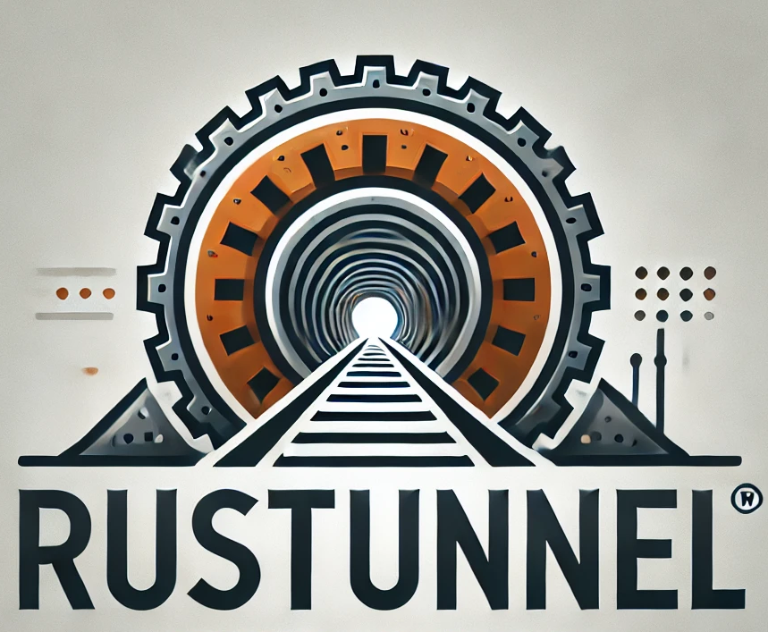

# **Rustunnel** - Covert Tunnel over DNS



## Overview

**Rustunnel** (Rust Tunnel) is a **work-in-progress** project designed to implement a covert communication channel over DNS. By leveraging DNS traffic, Rustunnel can tunnel arbitrary TCP/UDP traffic, allowing applications or commands to communicate in restricted environments where DNS is permitted but other protocols are blocked.

The project aims to provide a powerful yet lightweight solution for bypassing network restrictions while maintaining flexibility and performance, thanks to Rust's modern capabilities.

---

## Features

- **Covert Communication**: Transforms TCP/UDP traffic into DNS queries, allowing communication in restricted environments.
- **Custom DNS Protocol**: Encodes and decodes traffic into DNS queries and responses.
- **Bi-directional Proxy**: Enables seamless forwarding of traffic between client and server.
- **Rust-based Implementation**: Ensures high performance and memory safety.
- **Modular Design**: Future-proof architecture that can be adapted for various use cases.

---

## Components

### **1. Client**
The Rustunnel client acts as a command proxy. It intercepts application traffic, encodes it into DNS packets, and sends it to the Rustunnel server. The client provides a simple interface for executing commands and tunneling their traffic:
```bash
./client "command-to-execute"
```

### **2. Server**
The Rustunnel server is a custom DNS server that decodes DNS traffic from the client. It:
- Forwards the decoded traffic to the target destination (real server).
- Modifies source/destination addresses to maintain transparency.
- Encodes the response back into DNS format and sends it to the client.

---

## Architecture

1. **Client Workflow**:
   - Captures and encodes TCP/UDP traffic into DNS queries.
   - Sends the encoded traffic to the Rustunnel server.
   - Receives and decodes responses.

2. **Server Workflow**:
   - Acts as a DNS resolver, decoding and processing DNS queries from the client.
   - Forwards decoded traffic to the target server and captures the response.
   - Encodes responses into DNS format and sends them to the client.

---

## Work in Progress (WIP)

Rustunnel is currently under development. Planned features include:

- [ ] Full bi-directional communication support for TCP and UDP.
- [ ] Authentication mechanism for secure communication.
- [ ] Configurable DNS tunneling domain.
- [ ] Robust error handling and retries.
- [ ] Detailed documentation for deployment and customization.

Contributions are welcome to help expand and refine this project!

---

## Getting Started

### Prerequisites
- Rust (latest stable version)
- A domain configured to route traffic to the Rustunnel server
- Basic understanding of DNS and networking


## Contributing

Rustunnel is open-source and actively seeking contributors. If you're interested in helping with development, testing, or documentation, please feel free to create a pull request or open an issue.

---

## License

Rustunnel is licensed under the MIT License. See the `LICENSE` file for more details.
