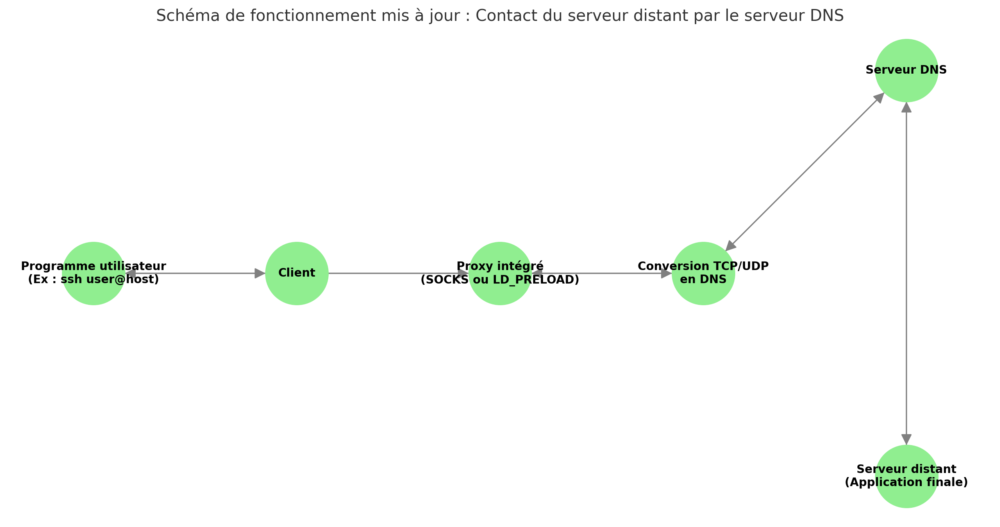

# Logique de fonctionnement du client

## Principe de fonctionnement

Le projet vise à développer un client capable de fonctionner dans un environnement restreint en droits tout en permettant d’exécuter des programmes via un proxy intégré. Les fonctionnalités principales incluent :

- Un script permettant de télécharger le client via des requêtes DNS, simplifiant le déploiement.
- Le client agit comme un proxy, permettant l'exécution de programmes à travers celui-ci. Par exemple :
  ```bash
  ./client "ssh user@host"
  ```

- Fonctionnement du proxy intégré :
  1. **Intercepter les requêtes TCP/UDP** des programmes.
  2. **Convertir les requêtes TCP/UDP en requêtes DNS**.
  3. **Envoyer les requêtes DNS** au serveur distant.
      1. Les requêtes seront envoyées à partir des servers DNS configuré par resolv.conf
      2. Si les requêtes DNS sont bloquées, le client utilisera un serveur DNS public.
  4. **Recevoir les réponses DNS** du serveur.
  5. **Convertir les réponses DNS en réponses TCP/UDP**.
  6. **Retourner les réponses TCP/UDP** au programme client.

Le client est conçu pour évoluer dans un environnement aux droits restreints.



---

## Méthodes pour implémenter le proxy

### **Solution 1 : Utilisation de Proxychains**

- **Description** :
  Le client déploiera un proxy SOCKS local sur un port aléatoire non filtré. Les programmes seront ensuite exécutés via `proxychains`, configuré pour utiliser le proxy local.
  Exemple :
  ```bash
  proxychains -f ./proxychains.conf ./client "ssh user@host"
  ```

- **Problème** :
  `proxychains` n'est pas installé par défaut sur la plupart des systèmes.

- **Solution proposée** :
  Télécharger et utiliser une version exécutable directement embarquée avec le client.
  - Le serveur DNS sera configuré pour récupérer/compiler des binaires statique de proxychains pour chaque architecture.
  - Le client, vérifiera si il possède proxychains, sinon déterminera l'architecture de la machine et récupérera le binaire par DNS.

---

### **Solution 2 : Intégration d’une bibliothèque de hooks (LD_PRELOAD)**

- **Description** :
  Implémenter une bibliothèque de hooks directement dans le client. Cela imite le fonctionnement de `proxychains` en interceptant les appels réseau via la variable d’environnement `LD_PRELOAD`. Les programmes seront exécutés dans des processus parents utilisant cette bibliothèque.

  Exemple :
  ```bash
  LD_PRELOAD=./libhook.so ./client "ssh user@host"
  ```

- **Avantages** :
  - Évite les dépendances externes comme `proxychains`.
  - Solution entièrement intégrée et autonome.

---

## Limitations des deux solutions

- **Compatibilité** :
  Aucune des solutions ne fonctionne avec des programmes compilés statiquement, car ils ne chargent pas dynamiquement les bibliothèques (nécessaires pour les hooks ou les interceptions).
  Pour le moment, des solutions pour traiter ce cas ne seront pas envisagées.
- **Environnement cible** :
  Ces solutions sont adaptées aux environnements avec des programmes utilisant des bibliothèques dynamiques.

---

## Mise en place

La solution pour le moment envisagée est celle de proxychains.
1. Déterminer l'architecture de la machine cible.
2. Mettre en place les fonctions permettant de télécharger des fichiers.
3. Tester et vérifier la validité du fichier reçu.
